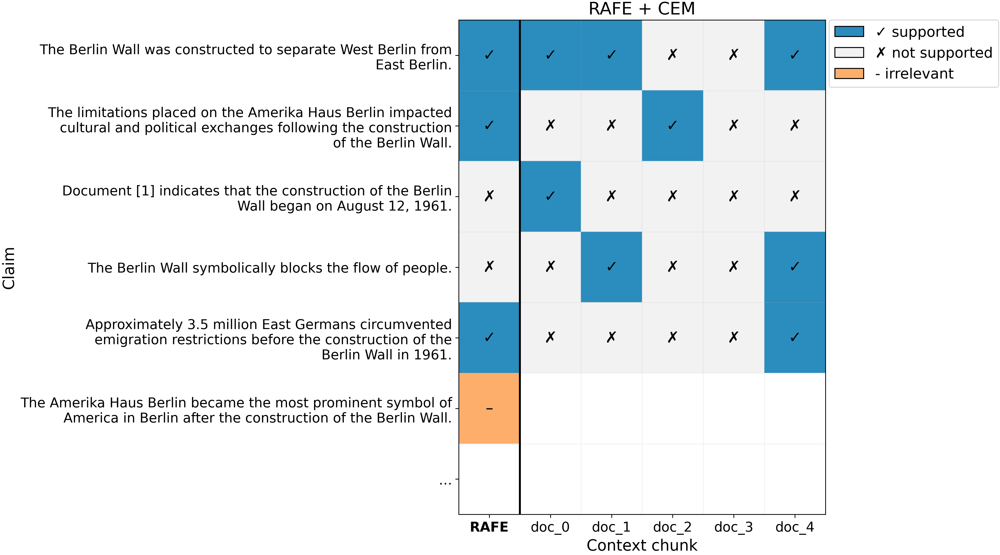

# Uncertainty Estimation in Long-Form RAG

Reliable uncertainty estimation matters in long-form Retrieval-Augmented Generation (RAG) because factual errors often come from *grounding failures* (claims not entailed by retrieved evidence), not from surface-level generation instability. This repo focuses on *epistemic* uncertainty under retrieval: how fragile a claim is with respect to the available context.

## Installation

To get started, clone the repository, set up a virtual environment, and install the project dependencies:

```bash
git clone git@github.com:FynnGerding/rag_uncertainty.git
cd rag_uncertainty
make setup
```

The pipeline can be run as follows:

```bash
make run
```

## Novelty: Claim-Evidence Matrix (CEM)

Claim-Evidence Matrix (**CEM**) is a RAG-specific framework to quantify *epistemic fragility* at the claim level. Unlike sampling-based consistency metrics, it directly measures whether atomic claims are *entailed by retrieved evidence*, targeting the “confident hallucination” regime where a model is stable but wrong.

#### Key Advantages

* Grounding over Consistency: tests whether claims are supported by retrieved documents, independent of model self-confidence.
* Efficiency: replaces $N$ full re-generations with a single generation pass plus parallelizable support checks.
* Retrieval-Awareness: highlights brittle claims that hinge on sparse evidence, and robust claims with redundant support.

#### Formulation

We decompose a response $R$ into atomic claims $C$ and construct a binary matrix $M$ where $M_{ij}=1$ if document chunk $d_j$ supports claim $c_i$. Claim uncertainty is defined as the inverse of evidence redundancy:

$$U(c_i) = 1 - \frac{1}{k} \sum_{j=1}^k M_{ij}$$

Here, $U \approx 0$ indicates redundant support across retrieved context, while high $U$ indicates weak or missing support.

#### CEM Example Visualization



## Long-Form Factuality in RAG: RAFE (vs SAFE)

We additionally propose **RAFE** (Retrieval-Augmented Factuality Estimation). Adapting DeepMind’s SAFE [(arXiv)](https://arxiv.org/pdf/2403.18802), RAFE replaces open-web search with *local context verification*, aligning evaluation with a closed-world RAG setting. Our code is adapted from DeepMind’s SAFE implementation [(GitHub)](https://github.com/google-deepmind/long-form-factuality). We use the [outlines library](https://github.com/dottxt-ai/outlines) to enforce structured atomic facts and strict `SUPPORTED` / `NOT_SUPPORTED` and `RELEVANT` / `IRRELEVANT` labels.

## Uncertainty Estimation Methods

Our implementations are based on **TruthTorchLM** [(GitHub)](https://github.com/lexin-zhou/TruthTorchLM).

### Semantic Entropy (White-box)

**Paper:** Semantic Uncertainty [(arXiv)](https://arxiv.org/abs/2302.09664)

Standard token entropy can overestimate uncertainty by treating semantically equivalent strings as distinct outcomes.

* Mechanism: sample multiple answers and cluster by meaning via bidirectional entailment (NLI).
* Metric: compute entropy over *semantic clusters* (requires access to logits or sequence probabilities).

### SumEigen (Black-box)

**Paper:** Generating with Confidence [(arXiv)](https://arxiv.org/abs/2305.19187)

For closed-source models without logits, uncertainty is approximated via dispersion in semantic space.

* Mechanism: sample multiple responses, build a similarity graph (e.g., NLI-based), form a Laplacian.
* Metric: uncertainty is the sum of Laplacian eigenvalues, proxying the number of distinct semantic modes.

## Data Source

The questions in `src/rag_uncertainty/questions.json` are taken from **Appendix E.6** of [Long-form factuality in large language models](https://arxiv.org/pdf/2403.18802).

## LLM

For all experiments we use [Qwen2.5-7B-Instruct](https://huggingface.co/Qwen/Qwen2.5-7B-Instruct) and the [outlines](https://dottxt-ai.github.io/outlines/latest/) library for structured outputs.
